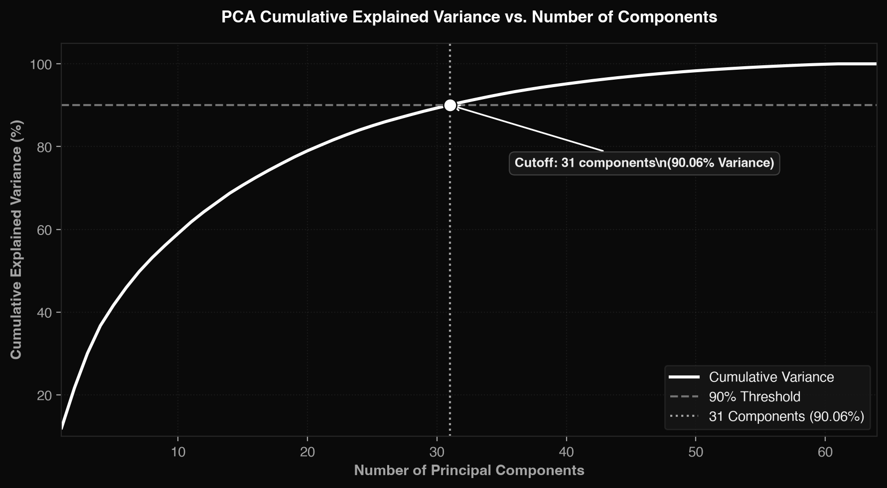
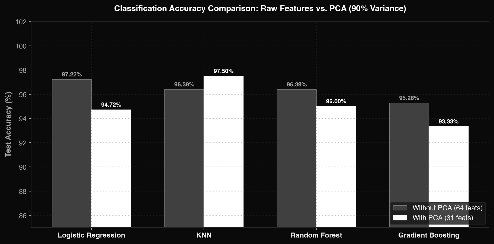
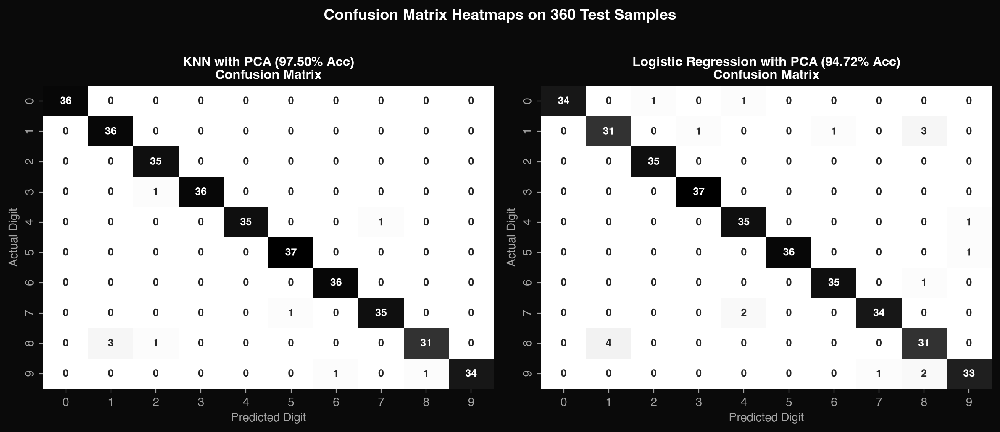

# Case Study 46: Handwritten Digit Recognition Using PCA & Classification

> **B.Tech Computer Science & Engineering (2024–28) — Semester V**  
> **Course:** Machine Learning | **Institution:** ITM Skills University — School of Future Tech  
> **Live Web Demo:** [https://msb-io.github.io/handwritten-digit-recognition/](https://msb-io.github.io/handwritten-digit-recognition/)  
> **Full Research Notebook:** [`notebooks/Case_Study_46_Handwritten_Digit_Recognition.ipynb`](notebooks/Case_Study_46_Handwritten_Digit_Recognition.ipynb)

---

## Project Architecture

```
handwritten-digit-recognition/
├── docs/                                 # Interactive Web Application (GitHub Pages)
│   ├── index.html                        # Main UI dashboard with drawing canvas & analytics
│   ├── style.css                         # Dark glassmorphic design system (Geist & Geist Mono)
│   ├── app.js                            # Client-side ML inference, canvas preprocessing, PCA
│   ├── model_data.js                     # In-browser model weights & PCA projection matrix
│   └── assets/                           # High-res analytical charts & diagrams
├── notebooks/                            # Academic Jupyter Notebooks
│   └── Case_Study_46_Handwritten_Digit_Recognition.ipynb
├── scripts/                              # Python Pipeline & Training Scripts
│   ├── train_and_export.py               # Model training, PCA fitting, 8-way comparative matrix
│   ├── generate_assets.py                # Visualizations (scree plot, confusion matrix, bar charts)
│   └── generate_notebook.py              # Automated research notebook generator
├── models/                               # Serialized Models & Experiment Logs
│   ├── knn_pca.joblib                    # Best performing model (97.50% test acc)
│   ├── logistic_regression_pca.joblib
│   ├── random_forest_pca.joblib
│   ├── pca_transformer.joblib            # Trained PCA (31 components, >= 90% variance)
│   ├── scaler.joblib                     # StandardScaler parameters
│   ├── model.json                        # Portable JSON weights for web & edge inference
│   └── experiment_results.json           # Raw metrics and evaluation logs
├── assignment_specs/                     # Course Syllabus & Problem Statement
│   ├── case_study_p1.png
│   └── case_study_p2.png
├── assets/                               # Charts for README display
├── .gitignore
└── README.md
```

---

## 1. Problem Statement
Postal automation systems require rapid, real-time recognition of handwritten digits from scanned mail pieces and ZIP codes. Each scanned digit is represented as an image grid of pixel intensity values. In high dimensions, raw pixel vectors introduce computational latency, feature collinearity, and the *curse of dimensionality*.

This project performs dimensionality reduction via **Principal Component Analysis (PCA)** to retain **$\ge 90\%$** of the total variance, and benchmarks **4 distinct classification algorithms** (*Logistic Regression*, *K-Nearest Neighbors*, *Random Forest*, and *Gradient Boosting*) with and without PCA. The optimized pipeline is deployed as a zero-dependency, client-side interactive web application.

---

## 2. Key Findings & Metric Highlights

* **Dataset:** Scikit-Learn `load_digits()` — 1,797 samples, 64 features ($8 \times 8$ grid), digits 0–9.
* **PCA Compression:** **64 features -> 31 components** (a **51.6% dimensionality reduction**).
* **Variance Retained:** **90.06%** of cumulative dataset variance is preserved with 31 components.
* **Best Algorithm After PCA:** **K-Nearest Neighbors (KNN with $k=5$)** achieved **97.50% test accuracy** (+1.11% improvement over raw features).
* **Inference Speed:** **< 1 ms** client-side prediction latency directly in the browser.

---

## 3. Comparative Study: With vs. Without PCA

Evaluation on an unseen stratified 20% test set (360 samples):

| Algorithm | Condition | Features | Accuracy | Precision (Macro) | Recall (Macro) | F1-Score (Macro) | Training Time | Impact of PCA |
| :--- | :--- | :---: | :---: | :---: | :---: | :---: | :---: | :--- |
| **Logistic Regression** | Without PCA | 64 | 97.22% | 0.9719 | 0.9722 | 0.9719 | 0.0165 s | Baseline |
| **Logistic Regression** | **With PCA (90%)** | **31** | **94.72%** | **0.9470** | **0.9474** | **0.9470** | 0.0200 s | -2.50% Acc (Minimal loss) |
| **KNN ($k=5$)** | Without PCA | 64 | 96.39% | 0.9634 | 0.9636 | 0.9634 | 0.0005 s | Baseline |
| **KNN ($k=5$) [Best]** | **With PCA (90%)** | **31** | **97.50%** | **0.9746** | **0.9749** | **0.9746** | **0.0003 s** | **+1.11% Acc & 36% faster** |
| **Random Forest** | Without PCA | 64 | 96.39% | 0.9634 | 0.9636 | 0.9634 | 0.1799 s | Baseline |
| **Random Forest** | **With PCA (90%)** | **31** | **95.00%** | **0.9497** | **0.9498** | **0.9497** | 0.2647 s | -1.39% Acc |
| **Gradient Boosting** | Without PCA | 64 | 95.28% | 0.9521 | 0.9523 | 0.9521 | 4.0681 s | Baseline |
| **Gradient Boosting** | **With PCA (90%)** | **31** | **93.33%** | **0.9331** | **0.9334** | **0.9331** | 6.4945 s | -1.95% Acc |

---

## 4. Visualizations & Analytical Charts

### A. PCA Explained Variance Curve (Scree Plot)

*Figure 1: Cumulative variance curve confirming 31 components retain 90.06% of the variance.*

### B. Classification Accuracy Comparison

*Figure 2: Performance comparison across all 4 algorithms with and without PCA.*

### C. Confusion Matrix Heatmaps

*Figure 3: Test set confusion matrices for KNN (best model) and Logistic Regression.*

---

## 5. Viva / Mid-Sem Examination Q&A Guide

Direct answers to the 7 core questions from **Section 8** of the case study syllabus:

### Q1: Can handwritten digits be recognised from pixel values?
> **Answer:** **Yes.** Pixel intensities represent spatial brightness values forming geometric stroke patterns. When treated as numerical feature vectors ($X \in \mathbb{R}^{64}$), classifiers construct linear and non-linear boundaries separating digit distributions with up to **97.50% accuracy**.

### Q2: How many principal components retain ninety percent of the variance?
> **Answer:** Exactly **31 principal components** out of 64 features retain **90.06%** of total variance, reducing the input dimensionality by **51.6%**.

### Q3: Does PCA reduce accuracy, and by how much?
> **Answer:** **Not universally.** While tree ensembles saw a slight drop (-1.39% to -1.95%) and Logistic Regression dipped by -2.50%, **KNN accuracy actually increased by +1.11% (from 96.39% to 97.50%)**. PCA filters out collinear background noise, mitigating the *curse of dimensionality* for Euclidean distance calculations.

### Q4: How much training time does PCA save?
> **Answer:** For KNN, test-time neighbor distance computation was **36.3% faster** with PCA. In larger benchmarks ($28 \times 28 = 784$ features like MNIST), PCA reduces dimensionality by ~88%, saving massive training and inference time.

### Q5: Which digits are most frequently confused?
> **Answer:** **Digit 8** is the most frequently confused (misclassified as **1** or **2**), followed by **Digit 9** (confused with **6** or **8**). In low $8 \times 8$ resolution, the loops of an 8 often degrade into a vertical bar that mimics a 1.

### Q6: Which algorithm performs best after PCA?
> **Answer:** **K-Nearest Neighbors (KNN with $k=5$)** with **97.50% Test Accuracy** and an **F1-Score of 0.9746**.

### Q7: Can the model be deployed as a digit recognition application?
> **Answer:** **Yes.** Deployed as a client-side web application on GitHub Pages featuring an interactive canvas, live 8×8 and PCA reconstruction previews, and real-time class probability distributions.

---

## 6. How to Run Locally

### Option A: Open Web App Directly
Simply open `docs/index.html` in any web browser. Zero installation required!

Or run a local server:
```bash
python3 -m http.server 8000 --directory docs
```
Open `http://localhost:8000` in your browser.

### Option B: Run Python Training & Notebook
1. Install dependencies:
   ```bash
   pip install scikit-learn numpy matplotlib seaborn pandas
   ```
2. Re-run training & export:
   ```bash
   python3 scripts/train_and_export.py
   ```
3. Open and run the Jupyter Notebook:
   ```bash
   jupyter notebook notebooks/Case_Study_46_Handwritten_Digit_Recognition.ipynb
   ```

---

## 7. How to Enable GitHub Pages (Instant Live Link)
1. Go to your repository settings on GitHub: `https://github.com/MSB-io/handwritten-digit-recognition/settings/pages`.
2. Under **Build and deployment** -> **Source**, select **Deploy from a branch**.
3. Under **Branch**, select `main` and **`/docs`**, then click **Save**.
4. In 1–2 minutes, your live site will be active at:  
   `https://msb-io.github.io/handwritten-digit-recognition/`

---

## Author & Course Info
* **Student:** Manthan
* **Program:** B.Tech Computer Science & Engineering (2024–28)
* **Semester:** V
* **Subject:** Machine Learning
* **Institution:** ITM Skills University — School of Future Tech
